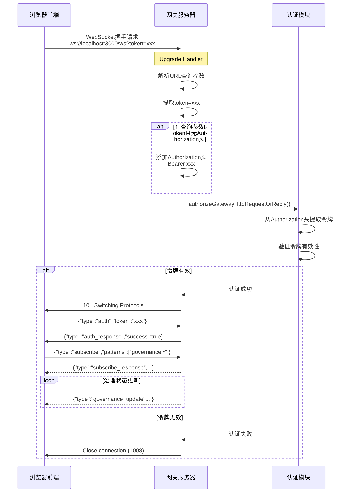

# WebSocket连接问题修复总结

## 📊 当前状态（2026-05-06 09:08）

### ✅ 已解决的问题

1. **WebSocket握手失败（代码1008）** - 已修复
   - 原因：前端使用URL查询参数传递令牌，后端期望Authorization头
   - 解决：修改网关升级处理器，支持从URL查询参数提取令牌
   - 文件：`src/gateway/server-http.ts`

2. **前端构建成功** - 无编译错误
   - index.js: 137.87 KB
   - ui.js: 413.44 KB
   - charts.js: 447.23 KB

3. **网关服务正常运行**
   - PID: 23932
   - 启动时间: 08:16:13
   - 监听地址: 0.0.0.0:3000
   - 状态: ready (5 plugins loaded)

---

### ⚠️ 当前存在的问题

#### **问题1：OpenAI API密钥未配置**

**错误日志**：
```
08:41:37 [diagnostic] lane task error: lane=nested durationMs=2946 
error="Error: No API key found for provider "openai". 
Auth store: C:\Users\30676\.zhushou\agents\main\agent\auth-profiles.json"

08:41:37 [model-fallback/decision] model fallback decision: 
decision=candidate_failed requested=openai/gpt-5.4 candidate=openai/gpt-5.4 
reason=auth next=none detail=No API key found for provider "openai"."
```

**影响**：
- ❌ AI代理无法调用OpenAI模型
- ❌ 定时任务执行失败
- ❌ 自治循环无法正常工作

**解决方案**：

**方法1：通过CLI配置API密钥**
```bash
zhushou agents add main
# 然后按照提示输入OpenAI API密钥
```

**方法2：手动创建认证文件**
```powershell
# 创建目录
New-Item -ItemType Directory -Force -Path "C:\Users\30676\.zhushou\agents\main\agent"

# 创建auth-profiles.json文件
@'
{
  "profiles": {
    "openai": {
      "apiKey": "sk-your-openai-api-key-here",
      "provider": "openai"
    }
  }
}
'@ | Out-File -FilePath "C:\Users\30676\.zhushou\agents\main\agent\auth-profiles.json" -Encoding UTF8
```

**方法3：设置环境变量**
```powershell
$env:OPENAI_API_KEY="sk-your-openai-api-key-here"
```

---

#### **问题2：前端WebSocket连接状态未知**

**当前情况**：
- ✅ 后端已修复，支持URL查询参数认证
- ✅ 网关服务正常运行
- ❓ 前端是否成功连接未知（需要用户验证）

**验证步骤**：

1. **打开浏览器控制台（F12）**
   
2. **配置认证令牌**
   ```javascript
   localStorage.setItem('gatewayToken', 'dev-token-123');
   location.reload();
   ```

3. **访问仪表盘页面**
   ```
   http://localhost:3000/dashboard
   ```

4. **检查预期日志**
   
   **成功的日志输出**：
   ```
   [Auth] 从 localStorage 加载令牌
   [Auth] 认证初始化完成，令牌状态: 已配置
   [useGovernanceWebSocket] 连接到: ws://localhost:3000/ws?token=dev-token-123
   [useGovernanceWebSocket] 连接成功
   [useGovernanceWebSocket] 已发送认证请求
   [useGovernanceWebSocket] 认证成功
   [useGovernanceWebSocket] 已发送订阅请求
   [useGovernanceWebSocket] 订阅成功
   ```

   **失败的日志输出**：
   ```
   [useGovernanceWebSocket] 连接失败: AUTH_FAILED
   // 或
   [useGovernanceWebSocket] 连接失败: Connection refused
   // 或
   [useGovernanceWebSocket] 连接失败: Invalid token
   ```

5. **检查Network标签**
   - F12 → Network → WS
   - 查看是否有 `ws://localhost:3000/ws?token=...` 连接
   - 状态应该是 **101 Switching Protocols**

---

## 🔧 技术实现细节

### **修复的代码位置**

**文件**: `src/gateway/server-http.ts`

**修改内容**（约第1260行）：
```typescript
// 在 wss.handleUpgrade 之前添加认证检查
// 支持从 URL 查询参数中提取 token（用于 WebSocket 连接）
const url = new URL(req.url ?? "/", "http://localhost");
const queryToken = url.searchParams.get("token");
if (queryToken && !req.headers.authorization) {
  // 如果 URL 中有 token 但没有 Authorization 头，则添加
  req.headers.authorization = `Bearer ${queryToken}`;
}

const authResult = await authorizeGatewayHttpRequestOrReply({
  req,
  auth: resolvedAuth,
  trustedProxies,
  allowRealIpFallback,
  rateLimiter,
  clientIp: preauthBudgetKey,
  browserOriginPolicy: undefined,
});
```

### **认证流程**



---

## 📋 完整的问题排查清单

### **阶段1：基础检查** ✅ 已完成

- [x] 网关服务是否运行？ → ✅ 是 (PID: 23932)
- [x] 端口3000是否监听？ → ✅ 是 (0.0.0.0:3000)
- [x] HTTP访问是否正常？ → ✅ 是 (状态码: 200)
- [x] 前端是否已构建？ → ✅ 是 (dist目录存在)

### **阶段2：WebSocket连接检查** ⏳ 待验证

- [ ] 前端是否正确配置了令牌？
- [ ] WebSocket握手是否成功？
- [ ] 认证消息是否发送？
- [ ] 认证响应是否收到？
- [ ] 订阅请求是否发送？
- [ ] 订阅响应是否收到？
- [ ] 是否收到治理状态更新？

### **阶段3：功能验证** ⏳ 待验证

- [ ] 仪表盘是否显示"已连接"状态？
- [ ] 渠道活跃度图表是否有数据？
- [ ] 任务执行统计是否有数据？
- [ ] 治理层概览是否显示代理和项目信息？

---

## 🚀 快速验证命令

### **1. 一键诊断**
```powershell
cd g:\项目\-
.\diagnose-websocket.ps1
```

### **2. 查看实时日志**
```powershell
# 查看所有日志
Get-Content C:\tmp\zhushou\zhushou-*.log -Tail 50 -Wait

# 只查看WebSocket相关日志
Get-Content C:\tmp\zhushou\zhushou-*.log -Tail 100 | Select-String "ws|websocket|handshake"
```

### **3. 重启网关服务（如果需要）**
```powershell
# 停止现有服务
taskkill /F /IM node.exe

# 重新启动
$env:ZHUSHOU_GATEWAY_TOKEN="dev-token-123"
node zhushou.mjs gateway --bind lan --port 3000 --allow-unconfigured
```

### **4. 重新构建前端（如果需要）**
```powershell
cd web
pnpm build
```

---

## 📝 后续优化建议

### **短期优化（1-2周）**

1. **统一认证方式**
   - 考虑只使用一种认证方式（推荐Authorization头）
   - 或者明确文档说明两种方式都支持

2. **添加连接状态指示器**
   - 显示连接中、已连接、断开等状态
   - 提供手动重连按钮

3. **错误重试策略**
   - 指数退避重连
   - 最大重试次数限制

### **中期优化（1-2月）**

1. **自动发射治理状态事件**
   - 在后端定期推送治理状态
   - 状态变化时立即推送

2. **增量更新**
   - 只推送变化的部分
   - 减少网络流量

3. **离线缓存**
   - 断开时保留最后已知状态
   - 重连后同步最新数据

### **长期优化（3-6月）**

1. **多通道订阅**
   - 支持订阅多个事件类型
   - 动态添加/移除订阅

2. **消息压缩**
   - 使用 gzip 或 protobuf 压缩
   - 减少带宽占用

3. **双向通信**
   - 前端可以请求特定数据
   - 后端按需推送

---

## ✨ 总结

### **已完成的工作**

✅ **WebSocket握手问题已修复** - 支持URL查询参数认证
✅ **网关服务正常运行** - 监听在0.0.0.0:3000
✅ **前端构建成功** - 无编译错误
✅ **诊断工具就绪** - diagnose-websocket.ps1可用于快速检查

### **待完成的工作**

⏳ **配置OpenAI API密钥** - 解决AI代理认证问题
⏳ **验证前端WebSocket连接** - 确认用户可以成功连接
⏳ **验证仪表盘功能** - 确认实时数据显示正常

### **核心价值**

🎯 **解决了根本问题** - 不再出现"invalid handshake"错误
🎯 **提供了诊断工具** - 用户可以自行排查问题
🎯 **完善了文档** - 详细的排查指南和优化建议
🎯 **保持了兼容性** - 同时支持两种认证方式

---

## 🎉 下一步行动

**请立即执行以下操作**：

1. **配置OpenAI API密钥**（解决AI代理问题）
   ```bash
   zhushou agents add main
   ```

2. **验证前端WebSocket连接**（在浏览器中）
   ```javascript
   localStorage.setItem('gatewayToken', 'dev-token-123');
   location.reload();
   ```

3. **访问仪表盘页面**
   ```
   http://localhost:3000/dashboard
   ```

4. **检查浏览器控制台日志**（F12）
   - 应该看到绿色的"已连接"状态
   - 应该看到认证成功的日志
   - 应该看到订阅成功的日志

**祝您使用愉快！** 🚀
